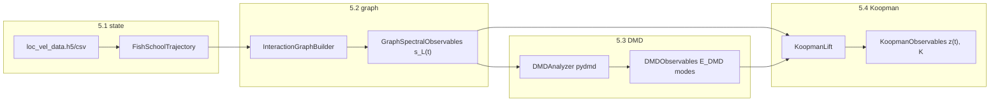

# Spectral Observables Implementation (5.2–5.4)

## Context

[Spectral_Learning.pdf](Spectral_Learning.pdf) defines a pipeline where **5.1** produces per-frame fish states `X(t)` (position + velocity), and **5.2–5.4** transform that into three observable families used throughout the rest of the thesis (5.5 phase ID, 5.6 transitions, 5.7 MARL reward, 5.8–5.9 validation).

Your **5.1 artifact** (from [couzinlab-check.ipynb](couzinlab-check.ipynb)) is already the right input:

- `{PREFIX}_loc_vel_data.h5` / `.csv`
- shape `(num_frames, 4 × num_fish)` with columns `fish{i}_x`, `fish{i}_y`, `fish{i}_vx`, `fish{i}_vy`

There is currently **no Python module** for this (only notebook helpers); [main.py](main.py) is empty. This plan formalizes 5.1 in code and adds 5.2–5.4 as separate, reusable modules.

## Target architecture



### Proposed package layout

```
spectral/
  __init__.py
  types.py                 # shared dataclasses / configs
  state.py                 # 5.1: load loc_vel, FishSchoolTrajectory
  graph/
    __init__.py
    interaction_graph.py   # 5.2: k-NN adjacency A(t)
    laplacian.py           # 5.2: L=D-A, eigendecomp, s_L(t)
  dmd/
    __init__.py
    analyzer.py            # 5.3: pydmd fit, modes, energies
  koopman/
    __init__.py
    lift.py                # 5.4: dictionary + z(t)
    operator.py            # 5.4: fit K, one-step prediction
  pipeline.py              # end-to-end 5.1→5.4 orchestration
  io.py                    # save/load intermediate results (npz/h5)
  phases/                  # stub for 5.5 (PhaseIdentifier)
  transitions/             # stub for 5.6 (TransitionDetector)
  evaluation/              # stub for 5.9 (metrics from eq. 25–28)
  rl/                      # stub for 5.7 (SpectralReward)
main.py                    # CLI entry points
requirements.txt           # numpy, scipy, h5py, pandas, pydmd
```

Future sections plug into the **same datatypes** (`GraphSpectralObservables`, `DMDObservables`, `KoopmanObservables`) so 5.5+ never re-parse raw CSV.

---

## 5.1 — Formalize state loading (`spectral/state.py`)

Extract the notebook logic into a typed loader (not re-run notebook code in production).

**Core types** ([`spectral/types.py`](spectral/types.py)):

```python
@dataclass(frozen=True)
class FishSchoolTrajectory:
    positions: np.ndarray      # (num_frames, num_fish, 2)
    velocities: np.ndarray     # (num_frames, num_fish, 2)
    valid_mask: np.ndarray     # (num_frames, num_fish) bool — False where NaN
    fps: float | None = None
```

**Loader API**:

- `load_trajectory_from_h5(path) -> FishSchoolTrajectory`
- `load_trajectory_from_csv(path) -> FishSchoolTrajectory`
- Reshape wide columns (`fish0_x`, …) into `(T, N, 2)`; treat NaN as invalid per fish/frame.

This matches eq. (1) in the PDF and is the **single input contract** for 5.2+.

---

## 5.2 — Graph Laplacian spectral observables

**Files:** [`spectral/graph/interaction_graph.py`](spectral/graph/interaction_graph.py), [`spectral/graph/laplacian.py`](spectral/graph/laplacian.py)

### Interaction graph (eq. 2–3)

- `InteractionGraphConfig`: `k_neighbors`, `symmetrize` (`"mutual"` | `"union"` | `"directed"`), optional distance cutoff.
- `build_adjacency(positions_t, valid_mask_t) -> (N, N)` using **k-nearest neighbors** in 2D (default `k=5`, symmetrize to `"mutual"` for stable Laplacian spectra).
- At each frame, use only fish with valid positions; pad/mask consistently.

### Laplacian spectrum (eq. 4–6)

- `L = D - A` (combinatorial Laplacian; normalized variant optional later).
- `eigh(L)` → eigenvalues `λ_k`, eigenvectors `u_k`.
- **`GraphSpectralObservables`**:
  - `eigenvalues`: `(T, num_modes)` — store `λ_2 … λ_{N-1}` (skip trivial `λ_1≈0`)
  - `algebraic_connectivity`: `(T,)` — `λ_2(t)` (key cohesion marker from PDF)
  - `spectral_vector`: `(T, d_L)` — `s_L(t) = [λ_2, λ_3, …]^T` (eq. 6)

**Batch API:** `GraphSpectralAnalyzer(config).compute(trajectory) -> GraphSpectralObservables`

Handle edge cases explicitly: `<2 valid fish` → NaN row; disconnected graphs → `λ_2→0`.

---

## 5.3 — DMD observables (pydmd)

**File:** [`spectral/dmd/dmd/analyzer.py`](spectral/dmd/analyzer.py)

Apply DMD to the **graph spectral sequence** `s_L(t)` first (PDF allows s_L, raw state, or combined; graph-first keeps dimension low and matches Year-1 workflow). Design so input is generic `(T, d)` for later combined observables.

### Algorithm (eq. 7–11)

- Build snapshot matrices `Y`, `Y'` from consecutive rows of observable matrix.
- Use **`pydmd.DMD`** (exact / svd rank-`r` truncation configurable).
- Extract:
  - modes `φ_k`, discrete eigenvalues `μ_k`
  - continuous rates `ω_k = log(μ_k) / Δt` (eq. 9; `Δt = 1/fps` or 1 frame)
  - time-varying modal amplitudes `b_k(t)` via projection
  - **modal energies** `E_k(t) = |b_k(t)|²` (eq. 11)

**Output type `DMDObservables`**:

```python
@dataclass
class DMDObservables:
    modes: np.ndarray              # (d, r)
    eigenvalues: np.ndarray        # (r,) complex
    frequencies: np.ndarray        # (r,) real
    amplitudes: np.ndarray         # (T, r)
    modal_energies: np.ndarray     # (T, r)
    reconstruction: np.ndarray     # (T, d) optional for 5.9 eq. 25
```

**API:** `DMDAnalyzer(rank=r, dt=...).fit(observable_matrix) -> DMDObservables`

Add `requirements.txt` with `pydmd`.

---

## 5.4 — Koopman observable space

**Files:** [`spectral/koopman/lift.py`](spectral/koopman/lift.py), [`spectral/koopman/operator.py`](spectral/koopman/operator.py)

Construct lifted state per eq. (13) from **allowed families only**:

```python
z(t) = [ s_L(t), E_DMD(t), s_L(t) ⊗ E_DMD(t), s_L(t)², E_DMD(t)² ]
```

(element-wise squares on feature blocks; configurable via `KoopmanLiftConfig` to avoid dimension explosion)

### Finite-dimensional Koopman fit (eq. 14)

- Stack snapshots `Z`, `Z'` from consecutive `z(t)`.
- **Extended DMD / least squares:** `K = Z' @ pinv(Z)` (or `pydmd` EDMD if cleaner).
- One-step prediction: `z(t+1) ≈ K @ z(t)`.

**Output `KoopmanObservables`**:

- `lifted_state`: `(T, d_z)`
- `operator`: `(d_z, d_z)`
- `feature_names`: list for interpretability

This module is intentionally **purely functional on 5.2+5.3 outputs** so 5.5 can use `z(t)` directly for stationary vs multistable tests (eq. 15–17).

---

## Pipeline and I/O

**[`spectral/pipeline.py`](spectral/pipeline.py)**

```python
def run_observable_pipeline(
    trajectory_path: Path,
    output_dir: Path,
    *,
    graph_config: InteractionGraphConfig,
    dmd_config: DMDConfig,
    koopman_config: KoopmanLiftConfig,
) -> ObservablePipelineResult:
    ...
```

**[`spectral/io.py`](spectral/io.py)** — save/load NPZ or H5 bundles:

- `graph_spectral.npz`
- `dmd_observables.npz`
- `koopman_observables.npz`

Enables incremental re-runs (e.g., re-fit DMD without rebuilding graphs).

---

## CLI ([`main.py`](main.py))

Subcommands aligned with methodology stages:

| Command | Section | Action |
|---------|---------|--------|
| `pipeline` | 5.1→5.4 | Full run on `{PREFIX}_loc_vel_data.h5` |
| `graph` | 5.2 | Graph spectra only |
| `dmd` | 5.3 | DMD on saved `s_L` or fresh graph run |
| `koopman` | 5.4 | Lift + K fit from saved intermediates |

Args: `--input`, `--output-dir`, `--prefix`, `--k-neighbors`, `--dmd-rank`, `--fps`.

---

## Stubs for later PDF sections (no implementation yet)

| Module | PDF | Future responsibility |
|--------|-----|------------------------|
| `spectral/phases/` | 5.5 | Stationary intervals (`‖z(t+Δt)-z(t)‖<ε`), modal entropy H(t) (eq. 16–17) |
| `spectral/transitions/` | 5.6 | Latent coordinate Φ, transition markers dλ₂/dt, P_ij (eq. 19–21) |
| `spectral/rl/` | 5.7 | Spectral imitation reward R_t (eq. 23) — same observable extractors on sim |
| `spectral/evaluation/` | 5.9 | Reconstruction error, F_L, F_D, F_K (eq. 25–28) |

Each stub exports a protocol/ABC documenting expected inputs so simulation code can implement the same interfaces.

---

## Testing strategy (lightweight)

- **Synthetic school**: 5–10 agents, circular orbit → expect high `λ_2`, low spectral variance.
- **Split cluster**: two groups → `λ_2 → 0` at split frames.
- **DMD**: sine-modulated `s_L` → recover dominant frequency within tolerance.
- **Koopman**: linear toy system where `K` is known → verify fit error.

No heavy pytest run unless you request `/test`; include `tests/test_graph_laplacian.py` with 2–3 unit tests.

---

## Migration from notebook

Move (don't duplicate long-term):

- `extract_loc_vel_table` / `save_loc_vel_*` → optional `spectral/state.py` export helpers, or keep notebook for data prep only and treat `.h5` as the handoff artifact.

Recommended workflow:

1. Notebook / couzinlab pipeline → `{PREFIX}_loc_vel_data.h5`
2. `python main.py pipeline -i schooling-datasets/10_fish/0105/0105_loc_vel_data.h5 -o results/0105`

---

## Key design decisions

- **Time-major arrays** `(T, …)` everywhere for alignment with DMD snapshot stacking.
- **Valid-mask aware graphs** so missing tracks don't corrupt k-NN.
- **pydmd** for 5.3 (per your preference); graph Laplacian and Koopman fit stay NumPy/SciPy.
- **Observable-first API**: downstream 5.5–5.9 consume dataclasses, not raw CSV columns.
